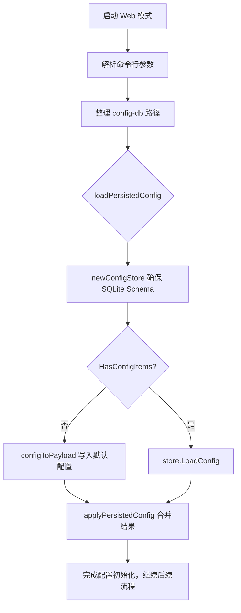

## 启动流程图

```mermaid
flowchart TD
    A[启动 Web 模式] --> B[解析命令行参数]
    B --> C[整理 config-db 路径]
    C --> D{loadPersistedConfig}
    D --> E[newConfigStore 确保 SQLite Schema]
    E --> F{HasConfigItems?}
    F -- 否 --> G[configToPayload 写入默认配置]
    F -- 是 --> H[store.LoadConfig]
    G --> I[applyPersistedConfig 合并结果]
    H --> I
    I --> J[完成配置初始化，继续后续流程]
```

> 该流程展示了 Web 启动阶段如何检测 SQLite 配置数据库、初始化默认配置并与启动参数合并。
